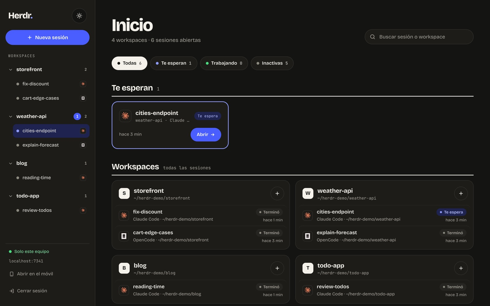
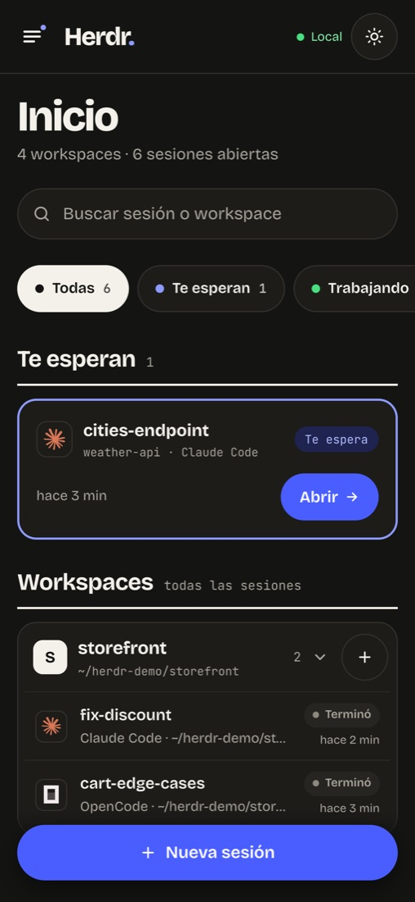
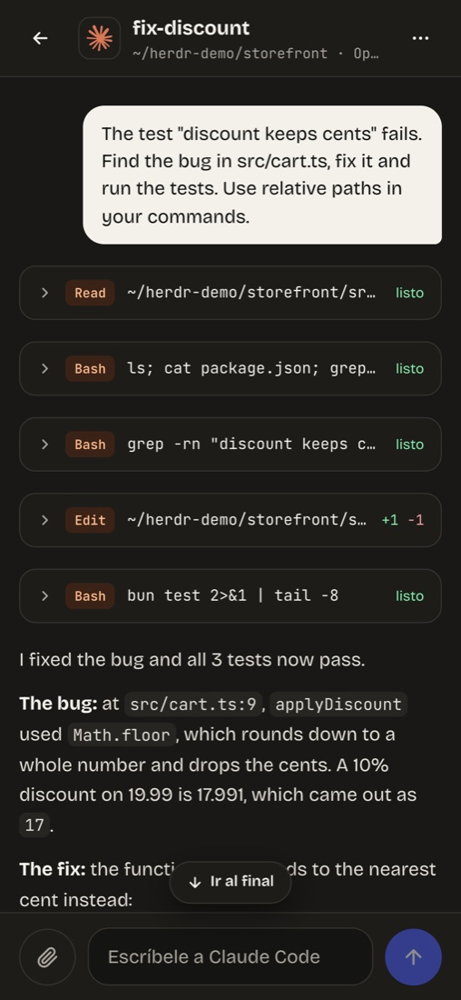
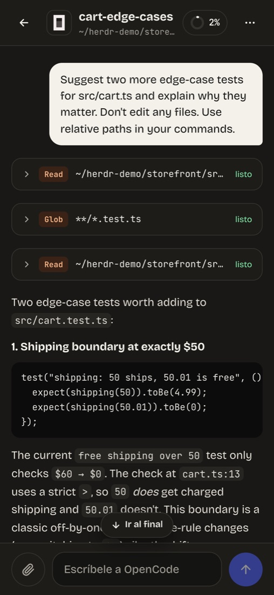
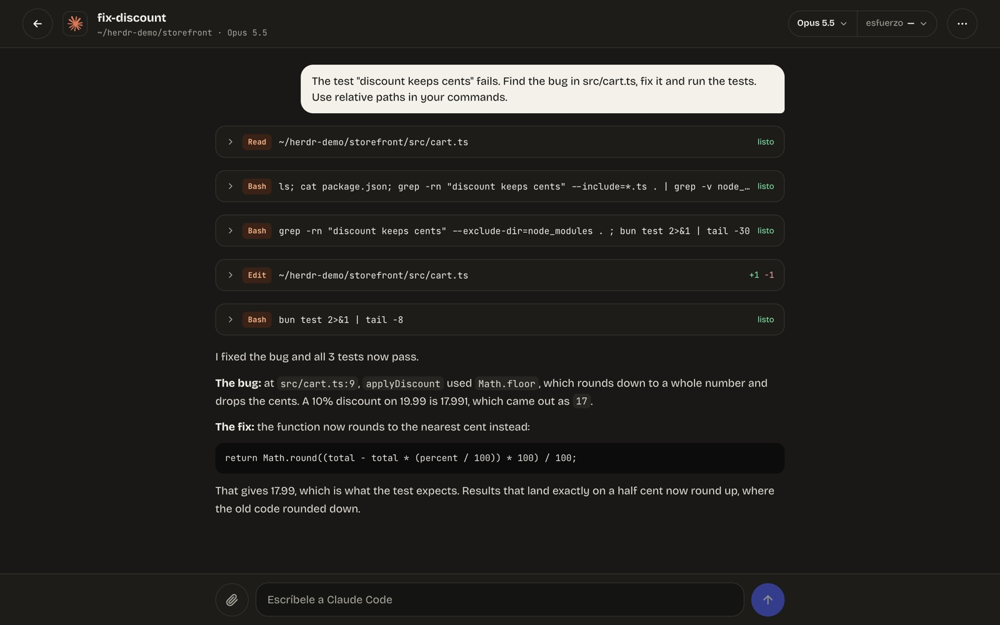
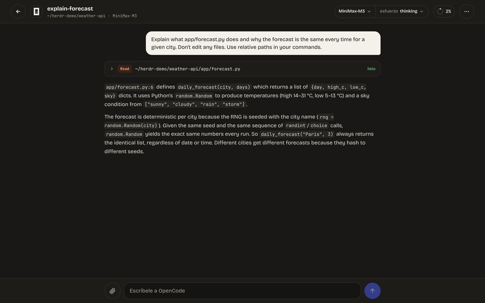
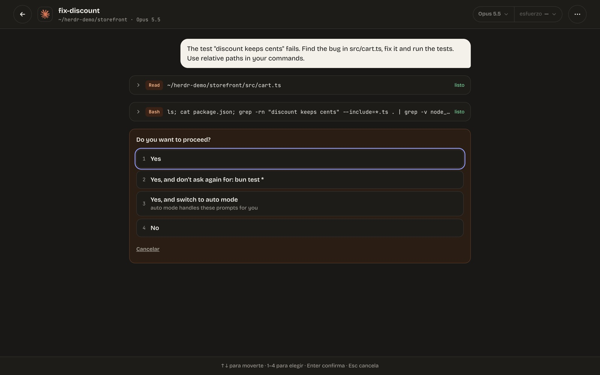
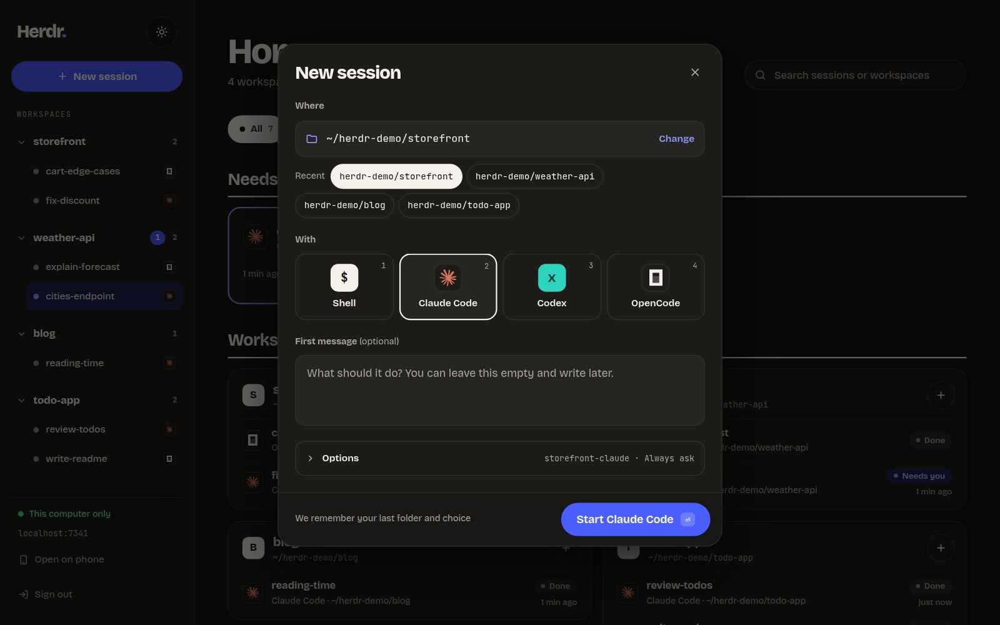

# Herdr Web Service

A web client for [Herdr](https://herdr.dev): talk to your **Claude Code** and **OpenCode** agents
like in a chat, from the browser or your phone, with its own password and HTTPS. It runs on your
computer, on your home network or on a VPS, and installs with a single command.



<p align="center">
  
  
  
</p>

> The interface is in Spanish for now.

## Features

- **All your Herdr sessions in one list**, grouped by workspace, with their state (working,
  waiting for you, done) and filters.
- **Chat with Claude Code and OpenCode**: messages, the tools they run, diffs of what they edit,
  plans and questions. Agent menus (permissions, questions, `/model`, `/effort`) are answered
  from the chat.
- **Model, effort and usage at a glance**: context used and Claude plan limits (5 h and weekly);
  for OpenCode, model, variant and cost.
- **New session** from the web: pick a folder and start a shell, Claude Code, Codex or OpenCode,
  with an optional first message and a permission mode. Claude Code and OpenCode can also start
  in **bypass** (no permission prompts: `--dangerously-skip-permissions` / `--auto`); it is never
  preselected, you choose it each time.
- **Notifications** when a session needs you or finishes: push notifications on your phone or
  desktop (turn them on per device; they need HTTPS, and on an iPhone the app installed on the
  home screen), plus a toast and a sound while the app is open. Mute the sound from Home or a
  session's `⋯` menu.
- **What the agent left running**: a tab above the chat input lists its subagents, background
  commands and monitors, so a long "Working…" explains itself.
- **Images in the chat** (PNG, JPEG, GIF, WebP) for the agent to read.
- **Terminal view** for shells, Codex and any session when you need it.
- **Installable app (PWA)** on your phone, plus a **QR code** to open it from your desktop.

| Claude Code chat | OpenCode chat |
|---|---|
|  |  |
| **Answering the agent's permission prompt** | **Starting a new session** |
|  |  |

## Requirements

- [Herdr](https://herdr.dev) 0.9 or later, on macOS or Linux.
- [Bun](https://bun.sh) 1.3 or later. It does not need to be on Herdr's `PATH`: the plugin also
  looks in `~/.bun/bin`.
- For the Claude Code chat, Herdr's integration: `herdr integration install claude`.

## Install

```sh
herdr plugin install i-montes/herdr-web-service
```

Then, inside Herdr (in a pane with a shell), open the setup wizard:

```sh
herdr plugin action invoke setup --plugin imontes.herdr-web-service
```

It opens as a Herdr popup. On a server, attach to Herdr first (`herdr --remote <server>` or
`ssh -t <server> herdr`): the popup shows up on Herdr's screen, not in a bare `ssh` session.

The wizard:

1. Asks where you will use it from (see [access modes](#access-modes)).
2. Asks for the password. It can only be set on the machine itself, never over the web.
3. Sets up the tunnel if needed.
4. Installs the service, which starts again after a reboot.
5. Registers Claude Code's status line (see [below](#claude-code-status-line)).
6. Checks that the URL answers, then shows the URL and a **QR code** to open it on your phone.

Run it again whenever you like: with the same answers nothing changes.

## Access modes

| Mode | For | HTTPS | Needs |
|---|---|---|---|
| This computer only | using it on the same machine | no (`localhost`) | nothing |
| Home Wi-Fi | opening it from your phone on your network | no | a local network IP |
| From anywhere | opening it from any network, or on a VPS | yes (tunnel) | a tunnel, see below |

In Wi-Fi mode the password travels unencrypted inside your network. Push notifications and
passkeys are planned, not available yet.

### Tunnels

No domain of your own and no open ports needed.

- **Tailscale Funnel** (recommended): a stable URL (`https://<machine>.<tailnet>.ts.net`) and a
  real certificate. Needs a Tailscale account.
  - On Linux the wizard uses `sudo` when needed: to install Tailscale, to run `tailscale up` if
    you are not logged in (it shows the login link) and for `tailscale set --operator`, so later
    steps don't need `sudo`. If the machine already had its own Tailscale settings (hostname,
    DNS...), they are kept.
  - On macOS it does not install Tailscale: install the app yourself.
  - The first time, Funnel may need to be enabled on your tailnet: the wizard shows the link
    and carries on as soon as you enable it.
- **Portal**: no account and no `sudo`; installed in your user. Portal assigns the URL, which is
  less stable.

The Tailscale URL only changes if you rename the machine or the tailnet in Tailscale's admin
console, or switch tunnels. If a wizard run would change it, it asks first.

## On your phone

1. When it finishes, the wizard shows the URL and a QR code. On the desktop, the web app also
   has **Open on phone** with the same QR.
2. Scan the QR code (in Wi-Fi mode, with the phone on the same network).
3. Sign in with your password.
4. Optional, in tunnel mode: "Add to Home Screen" from the browser to use it as an app.
5. Optional: **Turn on notifications** (Home's menu) to hear when a session needs you. On an
   iPhone, do it from the app opened from the home screen.

## On a VPS

Built for a public server: it only listens on `127.0.0.1` and is published through the tunnel,
so it neither uses nor touches ports 80/443 of other services (an nginx, for example).

With `ufw`, the wizard suggests closing incoming ports except SSH, since the tunnel needs none
open. It never applies this on its own:

```sh
sudo ufw default deny incoming && sudo ufw allow 22
```

The server runs as a user service (`systemd --user`). To keep it alive with no open login, the
wizard tries to enable `linger`; if it can't, it asks you to run
`sudo loginctl enable-linger <user>`.

## Security

- argon2id password, only set from the machine.
- Login rate limiting with growing back-off, plus a global brake against distributed guessing.
- Sessions last 30 days idle (180 at most); the cookie carries a token and the server only keeps
  its hash.
- `Host` and `Origin` checks, strict CSP, HSTS over HTTPS.
- The API and the WebSocket require a session.
- Push notifications are encrypted end to end (the push service only relays ciphertext), go only
  to known push services, and belong to the sign-in that turned them on: signing out stops them.

Details in `CLAUDE.md` (rules H1–H10).

## Claude Code status line

The chat shows Claude's context and plan limits thanks to Claude Code's status line. The wizard
registers it in `~/.claude/settings.json` (or `$CLAUDE_CONFIG_DIR`), and it also prints
`ctx 62% · 5h 34% · wk 12%` at the bottom of the terminal.

If you already had a status line, it is not replaced: it keeps running and its text comes first.
Uninstalling restores the original.

## Herdr actions

| Action | What it does |
|---|---|
| `setup` | Setup wizard |
| `start` / `stop` | Starts or stops the server |
| `status` | State, mode, URL and whether a password is set |
| `uninstall` | Removes services, tunnel and status line |

Run them with `herdr plugin action invoke <action> --plugin imontes.herdr-web-service`.

## Uninstall

The `uninstall` action turns Tailscale Funnel off (if you used it), removes the services, stops
any loose server and restores your Claude Code status line. It keeps the password and the
configuration, and does not uninstall Tailscale or Portal. Then:

```sh
herdr plugin uninstall imontes.herdr-web-service
```

## Troubleshooting

- **The wizard does not show up** after invoking `setup`: the popup opens on Herdr's screen.
  Attach to Herdr to see it. If it says `a popup pane is already open`, one is already open.
- **"This machine cannot resolve …ts.net yet"**: the
  server's DNS does not know the new tunnel name yet. The wizard checks through public DNS
  instead; from the internet it works the same.
- **Server log**: on Linux, `journalctl --user -u herdr-web-service.service`; on macOS,
  `server.log` in the state folder.

## Where things live

- Configuration and password: `~/.config/herdr/plugins/config/imontes.herdr-web-service/`
  (`.env`, `auth.json`, `vapid.json` with the push keys, and `claude-statusline.json` if you had
  another status line).
- State and log: `~/.local/state/herdr/plugins/imontes.herdr-web-service/`
  (`sessions.json`, `push.json`, `server.log`, `claude-status/`).
- If Herdr sets `HERDR_PLUGIN_CONFIG_DIR` and `HERDR_PLUGIN_STATE_DIR`, those paths are used.

## Development

```sh
bun install
bun run dev          # server (watch) + Vite at http://localhost:5173
bun test
bun run typecheck
bun run build        # web → dist/
herdr plugin link "$PWD"
```

`herdr plugin link` does not build the web app: after changes in `web/`, run `bun run build`.
More context and design decisions in `docs/RESEARCH.md` (Spanish); project conventions in
`CLAUDE.md`.

## License

MIT, see [LICENSE](LICENSE).
